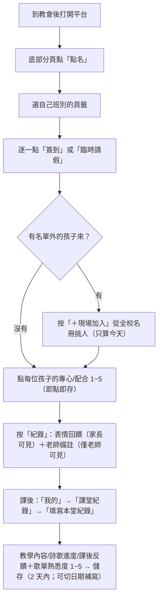
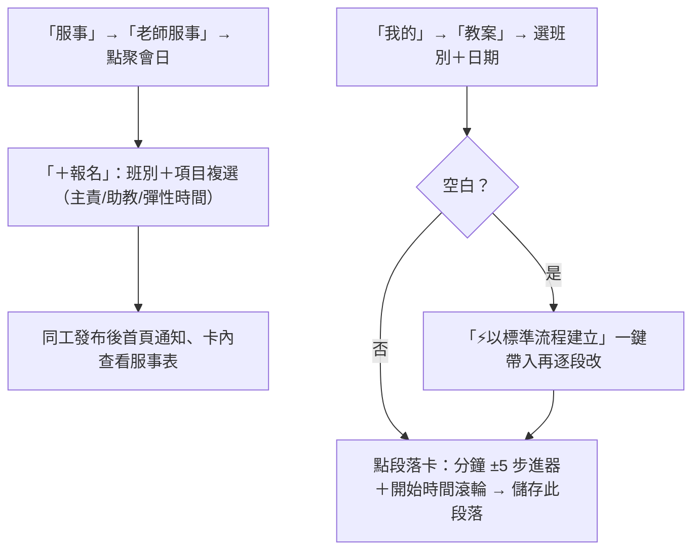
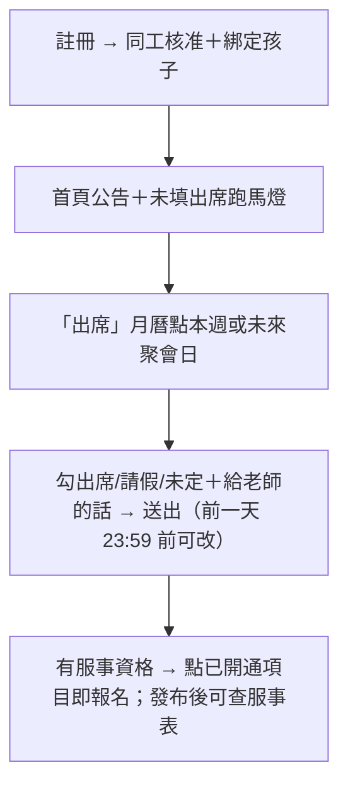
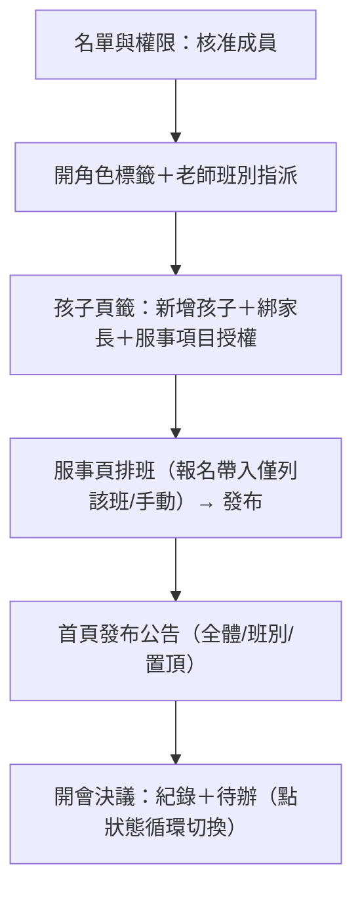

# 神國小領袖操作手冊 v1（2026-08-24，8/29 老師座談會用）

> 網頁版（可分享、含流程圖）：https://claude.ai/code/artifact/9a68af32-e76b-464b-8649-853df32f5fb3
> 座談會投影用流程圖（FigJam，可編輯）：https://www.figma.com/board/x82mTYHqVqhhZzNNAWUNq6
> 「柒個核心概念」為草稿，**待組長確認後定稿**。

## 三步驟開始使用

1. 手機瀏覽器開啟 https://kingdom-little-leaders.vercel.app
2. 用 Email 或 Google 註冊（稱呼建議填「○○老師」「○○媽媽」）
3. 通知同工核准帳號並開通標籤；建議「加入主畫面」像 App 開啟

## 壹、七個核心概念（草稿）

1. **一人一帳號，標籤定權限**——家長/老師/管理者是標籤、可兼任；沒看到某功能是還沒開通，不是壞掉
2. **老師只管自己的班**——點名/教案/紀錄/服事表以被指派班別為界
3. **回饋取代成績**——表情回饋給家長；指數 1–5 與老師備註僅老師同工可讀
4. **節奏跟著聚會日走**——出席：聚會前一天 23:59 截止（未來週可先填）；課堂紀錄：課後 2 天內（可補寫）；首頁跑馬燈自動提醒
5. **一段一存，共編不互蓋**——教案逐段儲存，兩位老師可同時編不同段
6. **點名以現場為準**——臨時來的用「＋現場加入」只算今天；真轉班由同工改名單
7. **兒童個資是紅線**——勿截圖名單/個資轉傳到平台外

## 貳、老師・主日當天

小技巧：點孩子姓名看近三個月走勢；統計列即時顯示 預計/實到/請假。

## 參、老師・備課與服事

寫教案依據＝「聚會流程與運作要點」（每段做什麼、抓幾分鐘）；教材資料庫外連教會雲端、可類別篩選；詩歌頁填班級熟悉度。

## 肆、家長端

## 伍、同工管理端（開學建檔順序）

出席（近半年）與課堂紀錄可匯出 CSV 存 NAS／匯入 Google 試算表。

## 陸、按鈕速查表

### 老師

| 在哪裡 | 按鈕 | 做什麼 |
| --- | --- | --- |
| 點名 | 簽到／臨時請假 | 記錄當天狀態；再點取消 |
| 點名 | ＋現場加入 | 全校名冊挑人，只算今天 |
| 點名 | 紀錄 | 表情回饋（家長可見）＋備註（僅老師） |
| 課堂紀錄 | 填寫本堂紀錄 | 彈窗上方日期列可切過去補寫（✓＝已有） |
| 教案 | ⚡以標準流程建立 | 空白日帶入標準流程再逐段改 |
| 教案 | ＋段落／↑↓ | 新段落自動接時間／調順序 |
| 服事 | ＋報名 | 項目複選；報名標籤按 ✕ 取消 |
| 詩歌 | 熟悉度 | 班級歌唱/動作 1–5（不評個別孩子） |

### 同工

| 在哪裡 | 按鈕 | 做什麼 |
| --- | --- | --- |
| 名單與權限 | ✓ 核准加入 | 開通成員；卡內勾標籤與班別 |
| 名單與權限 | ＋新增孩子 | 建資料、綁家長、服事項目授權 |
| 服事 | 安排／編輯＋發布開關 | 排班（帶入僅列該班）；發布才可見＋通知 |
| 首頁 | ＋發布公告 | 對象/標籤/置頂 |
| 開會決議 | 狀態標籤 | 點擊循環 待辦→進行中→已完成；逾期紅字 |
| 出席/課堂紀錄 | 匯出 CSV | 存 NAS 或 Google 試算表匯入 |

## 柒、常見問題

- **很多頁面看不到？** 審核未過或標籤未開；請同工到名單頁處理（老師還要指派班別）
- **忘記密碼？** 登入頁「忘記密碼？」寄重設信；沒收到可請同工代設
- **家長看不到孩子？** 尚未綁定；同工在「孩子」頁籤勾選家長（可多位）
- **點名沒這孩子？** 「＋現場加入」；真轉班由同工改班別
- **超過兩天忘了填課堂紀錄？** 彈窗切日期即可補寫
- **彈窗關不掉？** 右上 ✕；異常就下拉重整，多數輸入即點即存
